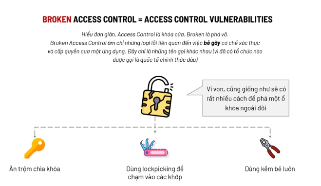

# ACCESS CONTROL VUNERRABILITIES

## Giới thiệu về Acess Control Vulnerabilities

Để hiểu rõ bản chất của lỗi này, ta cần phải phân biệt hai khái niệm : 

**Authentication và Authorization**

`Authentication` hay nói ví von nó như bước để xác minh danh tính của một ai đó. Chẳng hạn như `CCCD` trong cuộc sống thường ngày, hay trong môi trường Đại Học, nó sẽ là `thẻ sinh viên` hay `MSSV`

`Authorization` có nghĩa là uỷ quyền, tức là ta `được phép` làm những gì và `không được làm` những gì

-----> Access Control là cơ chế `kiểm soát quyền truy cập`. Trong đó:
    
    - Authentication chịu trách nhiệm kiểm tra danh tính của người dùng
    - Authorization chịu trách nhiệm cấp quyền hạn cho người dùng

`Access Control Vulnerabilities` là loại lỗi xuất hiện khi attacker có thể `truy cập` hoặc `chỉnh sửa` những tài nguyên mà vốn họ `không có quyền` tác động vào.



Access Control Vulnerabilities cũng có nhiều kiểu tấn công khác nhau, trong bài viết này chủ yếu nói về IDOR hay còn gọi là `Insecure Direct Object Reference`
----
`99,99%` lỗi IDOR xuất phát từ việc nhận `Untrust Data` là một `mã định danh (Identifier)` sau đó sử dụng mã định danh này cho nhiều mục đích khác nhau. Mã định danh cũng có thể là `ID` của người dùng, cũng có thể là `Cookie` hay `Session`,...

IDOR có 2 loại : 

- `Leo thang theo chiều dọc` ( Tác động với các tài nguyên với quyền `cao` hơn so với ban đầu )
- `Leo thang theo chiều ngang` ( Tác động với các tài nguyên với quyền `tương tự` như quyền của mình, nhưng đối với thông tin của `người khác` )


`Impact` của lỗi bảo mật này dẫn đến việc attacker có thể `read, write, delete,...` với các tài nguyên vốn không được phép tác động

```
Exploitation: Quan sát các gói tin HTTP Request-Response thật kĩ để xác định được Web-App sử dụng Identify như thế nào? Mã định danh đó được cấu tạo ra sao?
```
Các kiểu Identify :
```
- Identify là một mã tịnh tiến
- Identify là một mã random -----> Thử tìm quy tắc/thuật toán cấu thành mã định danh ấy
```
**Trong trường hợp**

Identify là một mã tịnh tiến ( Dễ đoán ) thì ta có thể dựa vào đó để xác định các Identify khác

Identify là một mã random thì ta có 2 cách : 
    
    - Tìm quy tắc/ thuật toán cấu thành mã định danh đó
    - Tìm nơi list các mã định danh ( Kết hợp với khai thác bằng lỗi bảo mật khác để tìm ra nơi nào đó list các mã định danh ra, ví dụ như SQL injection,RCE,...)

**Lưu ý**

Cần phải đọc source code về các loại lỗi IDOR để có thể `phản ứng` nhanh với môi trường `real-world`. Cũng như hiểu hơn về bản chất của lỗi bảo mật. Một khi đã hiểu được bản chất của lỗi bảo mật thì sự hiểu biết về các biến thể của nó chỉ là `vấn đề thời gian`

---
**Kiến thức của mình tạm thời chỉ có thể đến đây, khi nào mình cảm thấy có thể lĩnh hội được nhiều hơn thì sẽ tiếp tục commit lại bài này!** 

**Cảm ơn các bạn đã đọc, cũng cảm ơn chính bản thân mình**