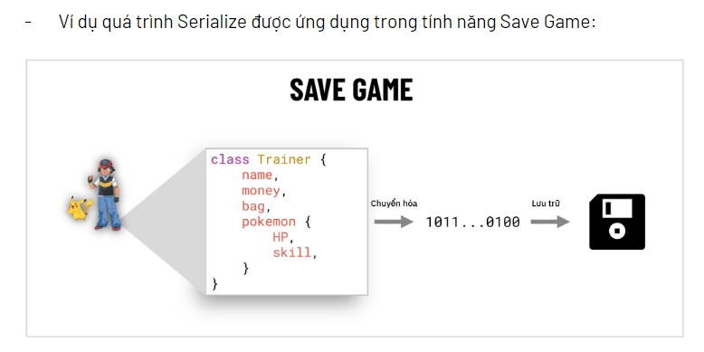
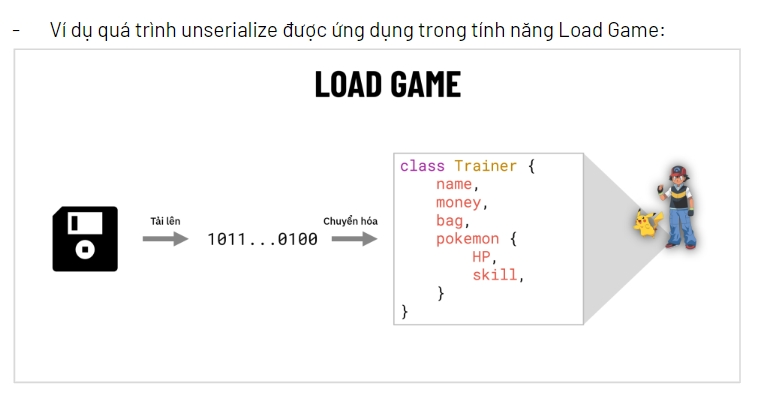
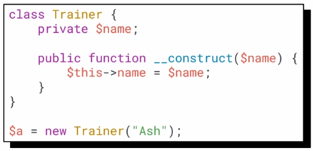
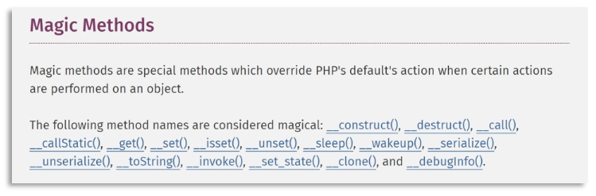
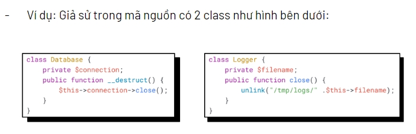
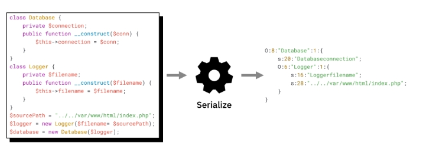
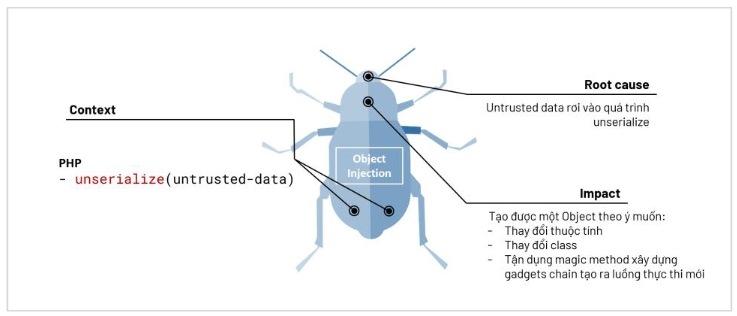

# PHP DESERIALIZATION 

## Giới thiệu về PHP Deserialization
**PHP Deserialization hay còn được gọi là PHP Object Injection**

Lỗi này thuộc chủng lỗi Injection, vì vậy nó cũng khiến cho hệ thống hiểu nhầm `User Input` là `Instruction`

```
Lỗi này xảy ra khi attacker truyền vào một chuỗi đã được Serialize vào hàm Unserialize.
Để gọi những hàm "Sink" nguy hiểm ("system()","exec()","eval()",...) trong chương trình.
Điều đặc biệt của Object Injection là hậu quả của loại lỗi này xảy ra rất đa dạng, nó tuỳ thuộc vào mẫu code có sẵn của chương trình.
```

Phía trên ta có nhắc đến `Serialize` và `Unserialize`. Vậy 2 hàm này có ý nghĩa gì ?

**Serialize** :

```
PHP và rất nhiều ngôn ngữ khác, cung cấp cho người dùng một hàm gọi là serialize().
Hàm serialize() này sẽ chuyển hoá một trạng thái của một đối tượng thành một chuỗi dữ liệu để có thể lưu trữ hoặc truyền đi.
```



**Unserialize** :

Sau khi chuỗi dữ liệu đã được `serialize` thì phải có một cách nào đó để chuyển hoá chuỗi dữ liệu này thành một `trạng thái` mà hệ thống có thể `hiểu` được và xử lý.

Chẳng hạn như `thằng em` của bạn là người `tháo rời` món đồ chơi của bạn ( Thì `thằng em` được gọi là `serialize` ). 

Và sau đó chính `bạn` lại phải `lắp ráp` lại món đồ chơi đó sao cho nó có `hình dạng` ( Thì `bạn` được gọi là Unserialize )

Thì đây là nhiệm vụ của `unserialize()`

*Hàm unserialize() sẽ chuyển hoá một chuỗi dữ liệu đã được serialize về "value" của PHP (PHP có thể hiểu).*



## Exploit PHP DESERIALIZATION
### Magic Method trong Object - Oriented Programing (OOP)
**1. __construct()**

Hàm `__construct()` được sử dụng rất thường xuyên trong lập trình hướng đối tượng.

Hàm này giúp chúng ta khởi tạo thuộc tính của một đối tượng

PHP sẽ tự động gọi hàm này khi tạo một đối tượng từ Class



**2. __destruct()**

Hàm `__destruct()` sẽ được tự động gọi, khi đối tượng trong chương trình không còn được tham chiếu đến nữa (Không còn được sử dụng nữa).

PHP tự động gọi mọi hàm `__destruct()` để huỷ tất cả các class còn tồn tại sau khi hoàn tất chương trình

-> Quá trình này được gọi là `clean up` . Hay nói ví von như là cách PHP `tiết kiệm` tài nguyên

**3.  _toString()**

Hàm `__toString()` sẽ tự động được gọi khi muốn in một Object ra màn hình dưới dạng chuỗi.

Hoặc sử dụng đối tượng đó dưới dạng `chuỗi`. Chẳng hạn như việc so sánh `Object` đó với một `chuỗi` khác. Thì tự động hàm `__toString()` sẽ được gọi

*Một số Magic-Methods khác :*



### Exploit Techniques

**Kỹ thuật tấn công POP (Property Oriented Programing)**

Kỹ thuật này bao gồm : 
    
- Tận dụng Magic Methods.
- Thay đổi thuộc tính của các Class

*-> Can thiệp vào luồng hoạt động của chương trình*



Tạo biến thuộc class `Logger` với `$filename` là đường dẫn mà bạn muốn attack (chẳng hạn như `"../"` để tấn công Path Traversal)

Tạo biến thuộc class `Database` rồi gán thuộc tính `connection` có giá trị là `biến` mà bạn vừa tạo thuộc class `Logger`.

Payload POP : 



Khi chương trình kết thúc, hàm `__destruct()` của Database sẽ gọi đến hàm `close()` của `Logger`. Dẫn đến việc `vô tình` khiến cho chương trình phải thực thi hàm `unlink` (Tức là xoá file)

## Conclusion

**Tips/tricks**

Có một công cụ là `phpgcc` có thể create `payload` để exploit các thư viện `cũ` trong PHP đối với dạng lỗi `Object Injection`


---

**Kiến thức của mình tạm thời chỉ có thể đến đây, khi nào mình cảm thấy có thể lĩnh hội được nhiều hơn thì sẽ tiếp tục commit lại bài này!** 

**Cảm ơn các bạn đã đọc, cũng cảm ơn chính bản thân mình**