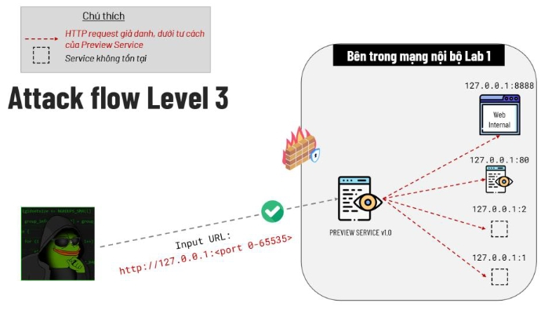

# Server-Side Request Forgery 
### Server-Side : 
Đơn giản là lỗi này xuất hiện ở phía `Server`
### Request : 
Request đơn giản là một `yêu cầu`
Có nghĩa là tất cả các dạng request, cách để giao tiếp với nhau
### Forgery : 
Cũng như nghĩa của nó, giả mạo/lừa đảo, `lợi dụng` danh tính của một ai đó/ thứ gì đó để làm thứ mình muốn

**Bản thân web-app cũng chỉ là một phần của hệ thống**
```
Chẳng hạn như Untrust Data nằm ở đường dẫn/file thì sẽ có các loại lỗi như File-Upload/ Path Traversal
Còn với SSRF, Untrust Data nằm ở tính năng xử lý URL ( Như Fetch image/video, preview, ... )
------> Từ đó, lỗi bảo mật này dẫn đến hệ quả rằng chúng ta có thể "lẻn" vào hệ thống nội bộ của một công ty/tổ chức nào đó. Mà đó chính là bước đệm cho các lỗi bảo mật nằm sâu bên trong hệ thống nội bộ.
```
**Bản chất SSRF là giả mạo server và gửi đi các request dưới danh nghĩa của server đó**

```
Giả sử như server đã phân quyền không cho phép 'source ip' bên ngoài mạng nội bộ truy cập
vào các api ở nội bộ thì "liệu rằng có những cách nào để giả mạo source ip?"
Rất khó để có thể thay đổi source ip, không đơn giản như việc thay đổi thông tin của các header ở gói HTTP request.
( Khi có một gói tin gửi đến server, server sẽ unpack gói tin thông qua các lớp trong mô hình OSI và kiểm tra địa chỉ nguồn, tức là nơi gần nhất gửi request đến server.
Ví dụ như Internal web được đóng gói trong docker và được chạy trên môi trường host, thì khi gửi các gói tin đến server, docker sẽ đóng vai trò như một forward proxy,
chuyển tiếp các gói tin liên lạc giữa host và guest. Trong trường hợp này thì source ip sẽ
là ip của docker engine chứ không phải của host hay guest, mặc dù ở máy host đã truy cập dưới dạng localhost)
```

Trong Networking có một địa chỉ IP đặc biệt đó chính là `localhost` hay là `127.0.0.1`, còn được gọi là loopback. Địa chỉ này sẽ khiến cho gói tin `call-back` lại chính máy của mình, hay trong trường hợp khai thác SSRF, gói tin sẽ `call-back` lại chính Internal Server.

------> Lợi dụng địa chỉ IP này để khiến cho `server` thay thế `attacker` fetch các api nằm sâu trong nội bộ mà chỉ có `những thiết bị` hoặc chính `server` mới có thể truy cập được.



**Ngoài việc lợi dụng server gửi request cho chính nó để fetch các API trong server thì ta cũng có thể gửi các gói tin request đến các thiết bị khác trong nội bộ bằng cách thao túng server**
---
***Những điều cần phải lưu ý***

**1**
```
Đối với dạng lỗi SSRF này thì attacker sẽ phải do thám lại từ đầu cũng như là kiểm thử dưới dạng black-box, khi tất cả thông tin đều là điểm mù.
```
**2**
```
Một khi đã khai thác bằng URL, thì phải biết đến Wrappers Protocol.
Một số Wrappers Protocol phổ biến trong PHP: 
    - file://
    - http://
    - ftp://
    - php://
    - ...
```
Một khi đã đột nhập được vào sâu bên trong hệ thống nội bộ rồi thì mọi thứ đều có thể `thiên biến vạn hoá`. Tất cả nằm ở `kiến thức - kinh nghiệm - trải nghiệm` của bạn.

---
## Tổng kết


---
**Kiến thức của mình tạm thời chỉ có thể đến đây, khi nào mình cảm thấy có thể lĩnh hội được nhiều hơn thì sẽ tiếp tục commit lại bài này!** 

**Cảm ơn các bạn đã đọc, cũng cảm ơn chính bản thân mình**